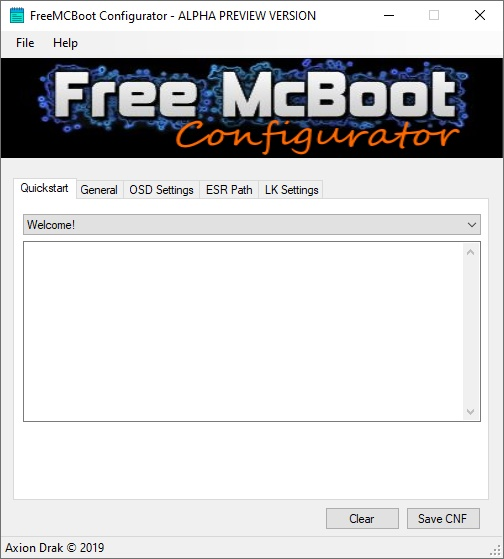
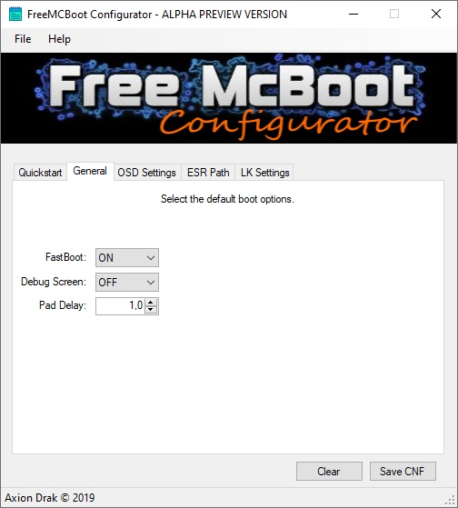
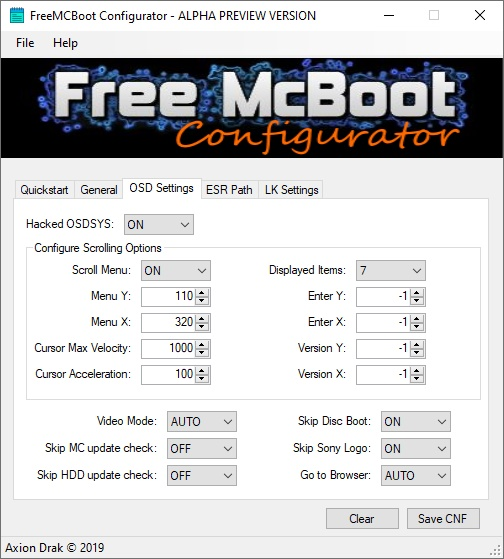
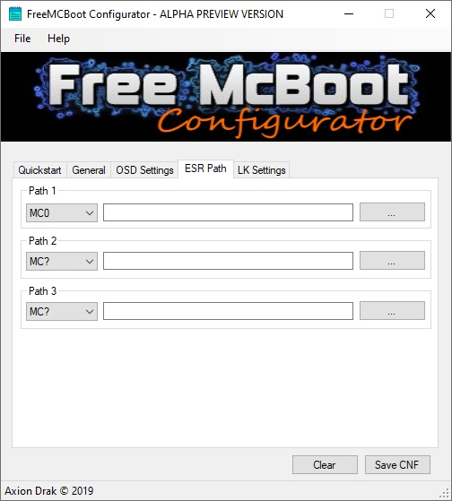
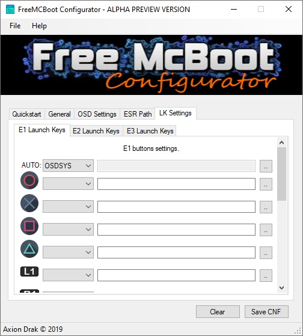

# FreeMcBoot Configurator

**FreeMcBoot Configurator** is a tool for creating _FREEMCB.CNF_ files compatible with **Free McBoot**.

## ATTENTION!!!
----------------
**This software is experimental!**

I'm just a self-taught software developer and decided to start learning C#. :)

So please don't mind the badly designed spaghetti code. :P

# Images

<link rel="stylesheet" href="//netdna.bootstrapcdn.com/bootstrap/3.1.0/css/bootstrap.min.css">

	<figure>
		
		

		

			
			
      
      
      		
		

		<figcaption></figcaption>
	</figure>

	

#### Official page:

* [FreeMcBoot Configurator - GitHub](https://github.com/AxionDrak/FreeMCBootConfigurator)

#### Download:

* [FreeMcBoot Configurator - ALPHA PREVIEW VERSION (NOT FUNCTIONAL!!!)](https://github.com/AxionDrak/FreeMCBootConfigurator/releases/tag/0.0.1.0)

## Hash
* * *
Use the table below to ensure that downloaded files do not change. These values are for files in their compiled (Alpha Preview) version.

| Filename                    | MD5                              | SHA256                                                           |
| --------------------------- | ---------------------------------|----------------------------------------------------------------- |
| LICENSE                     | e62637ea8a114355b985fd86c9ffbd6e | 230184f60bae2feaf244f10a8bac053c8ff33a183bcc365b4d8b876d2b7f4809 |
| FMCBootConfigurator_APV.exe | b8676883b2bd4ffc1fd19b1abeb4b9cc | b433ea04213383413ef96b965a9b48281b84a1ec4d4579e81a17bccd26faffe4 |
| README.md                   | 536643ae2f8e1ad86ccc731a3c8049ea | 6995ddc6e286be362ef6c819587d71e3d811f6d87532837f428bffbe72734a64 |

## Features
* * *
* Create FREEMCB.CNF file (for FREE McBoot) / under development. <b>NOT FUNCTIONAL!!!</b>

## Languages
* * *
* At the moment, only English is supported (sorry :/)

## Compile
* * *
See _COMPILE_ file for how to compile and install FreeMcBoot Configurator.

## Documentation
* * *
See _README_ for FreeMcBoot Configurator information.

## License
* * *
This project is released under the GNU license. If you redistribute the binary or source code of FreeMcBoot Configurator, please attach file _LICENSE_ with your products.
Review LICENSE file for further details.

* * *
Copyright 2019, Laete Meireles (a.k.a Axion Drak)

<<[back](./)
